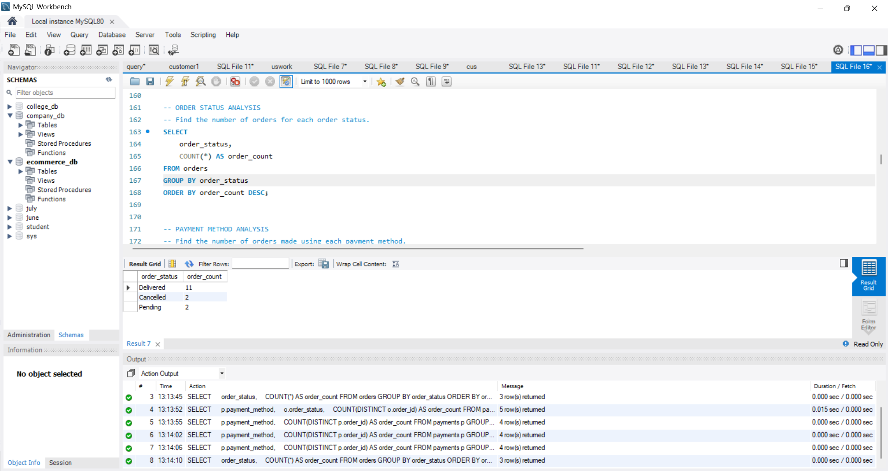
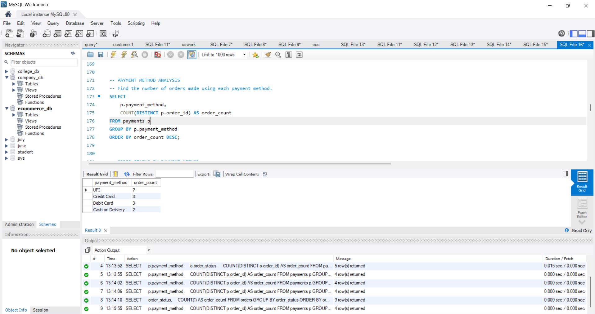
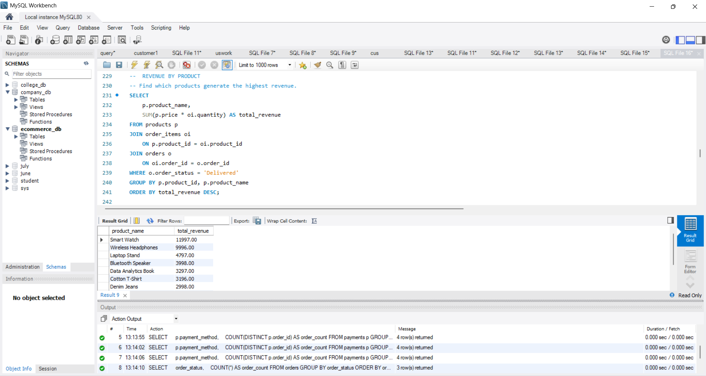
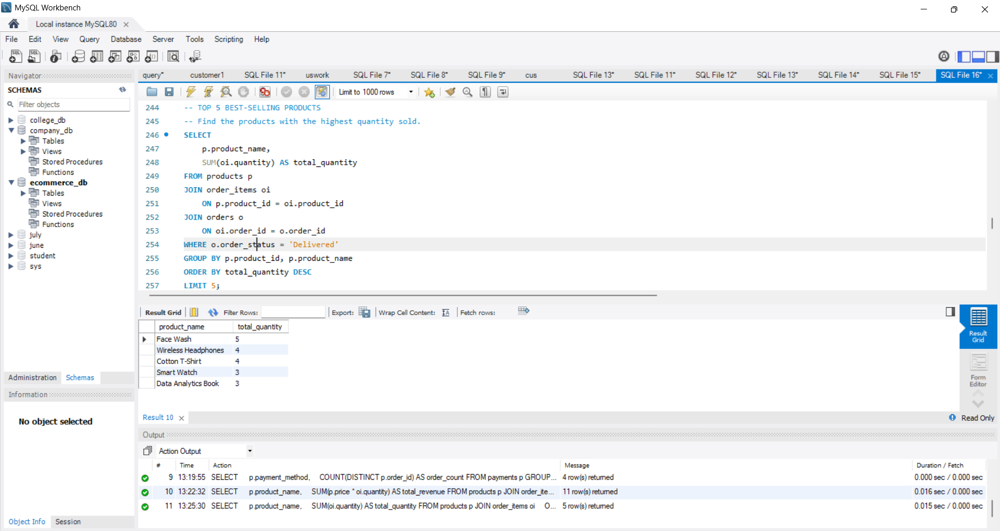
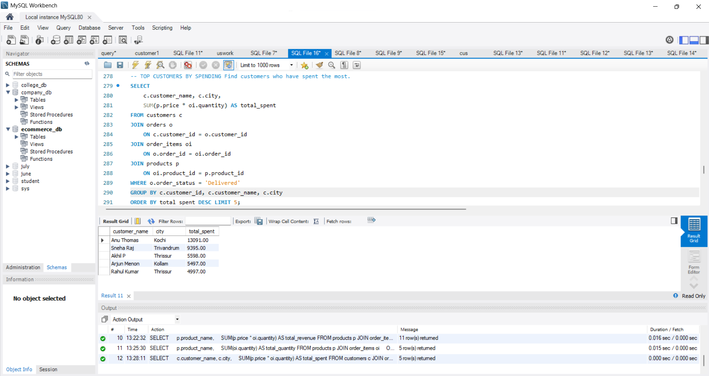

# 📊 E-Commerce Sales Analytics using MySQL

## Project Overview

This project is a SQL-based E-Commerce Sales Analytics project developed using MySQL.

The project uses a relational database to store and analyze information about customers, products, categories, orders, order items, and payments.

The main objective is to apply SQL to explore customer purchasing behavior, product performance, order trends, and revenue-related metrics.

## Database Structure

The database contains the following tables:

- Customers – customer details, contact information, city, and registration date
- Categories – product category information
- Products – product details, category, and pricing
- Orders – order information, customer details, order date, and order status
- Order Items – products and quantities associated with each order
- Payments – payment method and payment status associated with orders

## SQL Concepts Used

- CREATE DATABASE
- CREATE TABLE
- PRIMARY KEY
- FOREIGN KEY
- UNIQUE Constraint
- INSERT
- SELECT
- WHERE
- GROUP BY
- HAVING
- ORDER BY
- LIMIT
- JOIN
- LEFT JOIN
- DISTINCT
- Aggregate Functions
- COUNT()
- SUM()
- AVG()
- ROUND()
- Subqueries

## Key Analytics

The project includes business-focused analysis such as:

1. Order Status Analysis
2. Payment Method Analysis
3. Order Status by Payment Method
4. Customer Order Analysis
5. Highest-Priced Products
6. Total Revenue Analysis
7. Revenue by Product
8. Top 5 Best-Selling Products
9. Revenue by Category
10. Top Customers by Spending
11. High-Value Customer Analysis
12. Products Above Average Price
13. Products Never Ordered
14. Repeat Customer Analysis
15. Order Performance Summary
16. 
## 📊 Analytics Results

### 1. Order Status Analysis

### 2. Payment Method Analysis

### 3. Revenue by Product

### 4. Top 5 Best-Selling Products

### 5. Top Customers by Spending

## 💡 Key Insights

The analysis focuses on identifying:

- Order distribution across different statuses
- Customer purchasing patterns
- Frequently used payment methods
- Best-selling products
- Products generating the highest revenue
- Revenue contribution by category
- Top-spending customers
- High-value and repeat customers
- Products with no recorded sales
- Products priced above the overall average
- Overall order performance

## Tools Used

- MySQL
- MySQL Workbench
- GitHub

## Project File

`ecommerce-sales-analytics.sql` contains:

- Database creation
- Table creation
- Primary and foreign key relationships
- Constraints
- Sample data
- Business-focused SQL analytics queries

## How to Run

1. Open MySQL Workbench.
2. Open `ecommerce-sales-analytics.sql`.
3. Execute the script.
4. The database, tables, and sample data will be created.
5. Run the analytical queries to explore the results.

## Project Focus

This project focuses on applying SQL to a practical business scenario rather than only practicing individual SQL commands.

It demonstrates how data from multiple related tables can be combined using SQL to answer business questions and generate meaningful insights.

## Author

Saniga Sudheer

B.Tech Computer Science and Engineering Graduate
